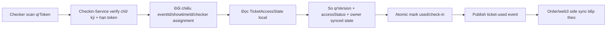

# Deep Research pháp lý, kỹ thuật và kiến trúc policy cho EvoTicket

## Executive Summary

Từ góc độ **pháp lý vận hành tại Việt Nam**, EvoTicket **không nên được nhìn như một website bán vé của chính mình theo nghĩa hẹp**. Với bối cảnh sản phẩm đã có nhiều organizer, có xác minh organizer, buyer mua vé qua nền tảng, có resale nội sàn, có xử lý tranh chấp, có quản trị thông tin giao dịch và có hạ tầng check-in/ownership riêng, mô hình phù hợp nhất là **mô hình lai**, trong đó lớp phân loại tuân thủ nên ưu tiên là **website/ứng dụng cung cấp dịch vụ thương mại điện tử, nhiều khả năng là sàn giao dịch thương mại điện tử chuyên ngành vé sự kiện**, đồng thời đồng thời là **nền tảng số trung gian** theo logic của Luật Bảo vệ quyền lợi người tiêu dùng 2023 và là **trung gian phân phối vé sự kiện** về mặt nghiệp vụ sản phẩm. Cách phân loại này bám sát định nghĩa chính thức giữa “website thương mại điện tử bán hàng” và “website cung cấp dịch vụ thương mại điện tử” của Bộ Công Thương, cũng như định nghĩa “sàn giao dịch thương mại điện tử” được cơ quan thông tin Chính phủ dẫn lại từ Nghị định 52/2013/NĐ-CP. citeturn23search2turn16search0turn0search0turn0search1

Về **những gì cần có ngay**, EvoTicket nên ưu tiên một bộ legal pages theo trục vận hành thực tế: **Terms of Use, Privacy Policy, General Transaction Conditions, Ticket Policy, Payment Policy, Refund and Event Change Policy, Dispute Resolution, Resale Policy, Organizer Terms, AI Chatbot Policy, Blockchain and NFT Policy**, cùng với **Help Center** và **FAQ**. Lý do không chỉ là “đẹp footer”, mà còn vì Luật Bảo vệ quyền lợi người tiêu dùng 2023 buộc bên kinh doanh và nền tảng số trung gian phải công khai thông tin giao dịch, điều kiện giao dịch chung, cơ chế tiếp nhận khiếu nại, công cụ giao kết hợp đồng từ xa, và khả năng truy xuất chứng từ giao dịch; đồng thời Nghị định 13/2023/NĐ-CP và từ ngày 01-01-2026 là Luật Bảo vệ dữ liệu cá nhân 2025 cùng Nghị định 356/2025/NĐ-CP đặt ra nghĩa vụ rất rõ về đồng ý, mục đích xử lý, lưu vết, đánh giá tác động và chuyển dữ liệu ra nước ngoài. citeturn12view0turn10view1turn10view2turn17view5turn20view1turn21view1turn5view3turn5view4

Về **rủi ro lớn nhất hiện nay**, ba nhóm nổi bật là:  
thứ nhất, **refund/cancel/hoãn sự kiện chưa được thiết kế đầy đủ trong code và policy**, trong khi Luật Bảo vệ quyền lợi người tiêu dùng 2023 cho người tiêu dùng quyền được cung cấp thông tin chính xác, nhận chứng từ, khiếu nại, và trong giao dịch từ xa được đơn phương chấm dứt trong một số trường hợp khi bên kinh doanh không cung cấp đúng/đủ thông tin bắt buộc;  
thứ hai, **trình bày sai vai trò pháp lý của nền tảng hoặc hiển thị sai trạng thái Bộ Công Thương** sẽ tạo rủi ro trực diện về thương mại điện tử;  
thứ ba, **NFT/blockchain/AI chatbot** nếu diễn đạt sai có thể bị hiểu thành cam kết đầu tư, cam kết kết quả hoặc cam kết pháp lý. Với AI, trong phạm vi nguồn chính thống được sử dụng cho báo cáo này, tôi **chưa xác định được một văn bản chuyên ngành đã có hiệu lực riêng cho chatbot AI thương mại**; vì vậy cần dựa vào khung chung của thương mại điện tử, bảo vệ người tiêu dùng, dữ liệu cá nhân và quảng cáo/trình bày thông tin. citeturn10view1turn12view1turn17view0turn23search2turn0search2turn25search0

Về **kết quả inspect source code**, có một phát hiện rất quan trọng: mô tả nghiệp vụ check-in mà bạn nêu ra **không hoàn toàn trùng với code hiện có**. Code cho thấy một flow **sync trước – verify local khi scan – publish used event – sync on-chain/batch sau**, chứ **không phải live on-chain ownership verification tại thời điểm quét QR**. Nói cách khác, Checkin-Service hiện không cho thấy bằng chứng gọi Order-Service rồi web3-worker để `ownerOf()` ngay trong scan flow; thay vào đó, ownership/trạng thái truy cập được đồng bộ trước vào `TicketAccessState`, và scan dùng trạng thái local + atomic update. Đây là thay đổi có ý nghĩa lớn cho legal wording của trang Check-in/Ticket Policy/Dispute Policy, vì bạn không nên hứa trên legal page rằng “mỗi lượt scan đều được xác minh trực tiếp on-chain theo thời gian thực” nếu code production chưa làm đúng như vậy.

Về **khuyến nghị kiến trúc**, phương án thực dụng nhất là:  
**frontend legal pages bằng MDX trong Next.js** để triển khai nhanh, review dễ, version-control rõ;  
**backend lưu consent theo version policy + hash nội dung + timestamp + flow + orderId/userId + IP/User-Agent** để có chứng cứ giao kết;  
và **đặt nền cho CMS sau này** bằng một registry và bảng `policy_versions`. Điều này phù hợp cả với Luật Bảo vệ quyền lợi người tiêu dùng 2023 về bằng chứng giao dịch/truy xuất chứng từ và với Nghị định 13/2023/NĐ-CP về trách nhiệm chứng minh việc xử lý dữ liệu và lưu nhật ký hệ thống. citeturn12view0turn20view1turn20view4

## Legal Classification và Legal Source Map

### Phân loại pháp lý của EvoTicket

Bảng dưới đây là kết luận thực dụng để triển khai tuân thủ, không phải ý kiến tư vấn luật cuối cùng.

| Nhãn phân loại | Kết luận | Mức độ chắc chắn | Căn cứ chính | Nhận xét áp dụng cho EvoTicket |
|---|---|---:|---|---|
| Website TMĐT bán hàng của chính mình | **Không phải phân loại chính** | Trung bình thấp | Bộ Công Thương phân biệt website TMĐT bán hàng với website cung cấp dịch vụ TMĐT; website bán hàng là website do thương nhân/tổ chức/cá nhân thiết lập để bán hàng hóa/cung ứng dịch vụ của **chính mình**. citeturn23search2 | Chỉ đúng nếu EvoTicket là người bán chính cho toàn bộ vé. Bối cảnh và code không đi theo hướng này. |
| Website/ứng dụng cung cấp dịch vụ TMĐT | **Có khả năng rất cao** | Cao | Bộ Công Thương nêu website cung cấp dịch vụ TMĐT là website do thương nhân/tổ chức thiết lập để cung cấp môi trường cho thương nhân/tổ chức/cá nhân khác tiến hành hoạt động thương mại. citeturn23search2 | EvoTicket xác minh organizer, cho organizer đăng event, bán vé cho buyer trên nền tảng. |
| Sàn giao dịch TMĐT | **Phân loại tuân thủ nên ưu tiên** | Cao | “Sàn giao dịch TMĐT” được dẫn theo Nghị định 52/2013/NĐ-CP là website cho phép chủ thể không phải chủ sở hữu website tiến hành một phần hoặc toàn bộ quy trình mua bán hàng hóa, dịch vụ trên đó. citeturn16search0 | Vé sự kiện là một loại dịch vụ/quyền tham dự được giao dịch trên nền tảng; organizer không phải chủ sở hữu website. |
| Nền tảng số trung gian | **Áp dụng đồng thời** | Cao | Luật Bảo vệ quyền lợi người tiêu dùng 2023 quy định trách nhiệm của tổ chức/cá nhân kinh doanh trên không gian mạng và của nền tảng số trung gian, gồm công khai quy chế, đầu mối khiếu nại, lưu trữ thông tin giao dịch, truy xuất hóa đơn/chứng từ. citeturn11view0turn10view2 | EvoTicket đúng với logic “platform intermediary” vì lưu giao dịch, xử lý resale, check-in, dispute support. |
| Trung gian phân phối vé / marketplace vé sự kiện | **Đúng về nghiệp vụ sản phẩm** | Cao | Suy luận từ code và product flow | Đây là mô tả business/ops phù hợp nhất trong tài liệu sản phẩm. |
| Tổ chức cung ứng dịch vụ trung gian thanh toán | **Chưa đủ căn cứ để kết luận có** | Cần luật sư xác nhận | Nghị định 52/2024/NĐ-CP điều chỉnh thanh toán không dùng tiền mặt; PayOS/SePay là đơn vị xử lý payment link/webhook. citeturn5view5turn5view6turn5view7 | Code cho thấy EvoTicket **tích hợp** PayOS/SePay, không tự xây “payment rail”; tuy nhiên mô hình đối soát/payout cho organizer và resale cần rà soát kỹ với luật sư. |
| Sàn tài sản số / sàn NFT theo nghĩa được luật hóa riêng | **Chưa tìm thấy căn cứ trực tiếp** | Chưa đủ căn cứ | Trong phạm vi nguồn chính thống dùng cho báo cáo này, tôi chưa xác định được một văn bản Việt Nam đang có hiệu lực quy định riêng toàn diện cho NFT ticket resale marketplace | Nên mô tả NFT là lớp chứng thư/truy vết kỹ thuật, tránh dùng ngôn ngữ đầu tư/tài sản sinh lời. |

**Kết luận dùng để triển khai:** nếu EvoTicket vận hành đa organizer như code và bối cảnh mô tả hiện nay, cách tiếp cận an toàn nhất là xem EvoTicket như **sàn TMĐT chuyên ngành vé sự kiện + nền tảng số trung gian + trung gian phân phối vé**, không phải chỉ là website giới thiệu vé của chính EvoTicket. Điều này kéo theo yêu cầu chặt hơn về **quy chế hoạt động, công khai thông tin, xử lý khiếu nại, lưu vết giao dịch, xác minh người bán/organizer và đăng ký/thông báo Bộ Công Thương**. citeturn23search2turn16search0turn10view2

### Legal Source Map

Bảng dưới đây chỉ dùng **nguồn chính thống hoặc đáng tin cậy cao theo yêu cầu**. Tôi ưu tiên văn bản gốc; nơi môi trường tra cứu không trích xuất được điều khoản đầy đủ, tôi ghi rõ mức xác định.

| Văn bản | Số hiệu | Điều/khoản dùng được trong báo cáo | Nội dung liên quan cho EvoTicket | Áp dụng vào policy/page nào | Nguồn | Trạng thái |
|---|---|---|---|---|---|---|
| Nghị định về thương mại điện tử | 52/2013/NĐ-CP | Môi trường tra cứu hiện tại xác nhận metadata; định nghĩa “sàn giao dịch TMĐT” được cơ quan Chính phủ dẫn lại; Điều 52, 53 về website bán hàng được MOIT dẫn trong bài xử phạt | Khung TMĐT nền tảng, website bán hàng, website cung cấp dịch vụ TMĐT, sàn TMĐT | Footer legal, classification, organizer terms, platform rules | citeturn0search0turn16search0turn28search4 | Có hiệu lực; đã được sửa đổi bởi 85/2021 |
| Nghị định sửa đổi Nghị định 52 | 85/2021/NĐ-CP | Metadata chính thức xác nhận hiệu lực; MOIT/online.gov nêu thêm trách nhiệm bên thứ ba, platform, seller nước ngoài, chính sách kiểm hàng | Tăng trách nhiệm của nền tảng TMĐT và bên thứ ba cung cấp thông tin | Terms, Transaction Conditions, Organizer Terms, Complaint pages | citeturn0search1turn28search2turn14search8 | Có hiệu lực từ 01-01-2022 |
| Hướng dẫn MOIT về thông báo/đăng ký website TMĐT | Không phải VBQPPL, là hướng dẫn vận hành | — | Phân biệt website TMĐT bán hàng và website cung cấp dịch vụ TMĐT; nêu nghĩa vụ thông báo/đăng ký; chỉ được gắn logo sau khi hoàn tất thủ tục | Footer certification, compliance checklist | citeturn23search2turn0search2 | Đang dùng tham chiếu vận hành |
| Luật Giao dịch điện tử | 20/2023/QH15 | Metadata chính thức; bài CECA/diễn đàn CECA dẫn Điều 11 về giá trị pháp lý/chứng cứ của thông điệp dữ liệu | Giá trị pháp lý của giao kết điện tử, chứng cứ điện tử, hợp đồng điện tử | Terms, Transaction Conditions, Consent logging, dispute evidence | citeturn0search3turn26search1turn8search1 | Có hiệu lực từ 01-07-2024 |
| Nghị định về chữ ký điện tử và dịch vụ tin cậy | 23/2025/NĐ-CP | Metadata/bài chính sách chính phủ | Liên quan khi EvoTicket sau này muốn dùng dịch vụ tin cậy/dấu thời gian/chứng thực thông điệp dữ liệu cho hợp đồng/consent logs | Future roadmap, not mandatory v1 | citeturn26search8turn26search3 | Có hiệu lực |
| Luật Bảo vệ quyền lợi người tiêu dùng | 19/2023/QH15 | Điều 16-21, 24-31, 37-39, 54-71 đã trích xuất được | Thông tin bắt buộc, điều kiện giao dịch chung, hợp đồng theo mẫu, bằng chứng giao dịch, khiếu nại, giao dịch từ xa, nền tảng số trung gian, phương thức giải quyết tranh chấp | Terms, Transaction Conditions, Refund, Dispute, Footer legal | citeturn12view1turn12view0turn10view1turn10view2turn17view0turn17view1turn17view3turn17view5 | Có hiệu lực từ 01-07-2024 |
| Nghị định chi tiết Luật BVQLNTD | 55/2024/NĐ-CP | Metadata chính thức | Hỗ trợ thi hành Luật BVQLNTD 2023 | Dispute, complaint, process docs | citeturn2search1 | Có hiệu lực từ 01-07-2024 |
| Nghị định bảo vệ dữ liệu cá nhân | 13/2023/NĐ-CP | Điều 9, 11, 24, 25, 38 đã trích xuất được | Quyền chủ thể dữ liệu, đồng ý, đánh giá tác động xử lý, chuyển dữ liệu ra nước ngoài, nhật ký xử lý | Privacy Policy, consent UX/data model, chatbot, blockchain disclosure | citeturn18search1turn21view0turn20view1turn21view1turn20view4 | Có hiệu lực từ 01-07-2023 |
| Luật Bảo vệ dữ liệu cá nhân | 91/2025/QH15 | Metadata chính thức; bài chính sách chính phủ hỗ trợ một số điểm | Luật nền tảng mới về dữ liệu cá nhân từ 2026 | Privacy Policy, data governance roadmap | citeturn5view3turn19view2turn19view3 | Có hiệu lực từ 01-01-2026 |
| Nghị định chi tiết Luật BVDLCN | 356/2025/NĐ-CP | Metadata chính thức; trích dẫn tổng hợp về nhân sự/bộ phận bảo vệ dữ liệu, hồ sơ đánh giá tác động | Cụ thể hóa Luật BVDLCN 2025 | Privacy governance, DPA/DPIA, cross-border | citeturn5view4turn22search4 | Có hiệu lực từ 01-01-2026 |
| Nghị định thanh toán không dùng tiền mặt | 52/2024/NĐ-CP | Metadata chính thức | Khung chung thanh toán không dùng tiền mặt; giúp xác định EvoTicket không nên tự mô tả như bên tự cung cấp dịch vụ thanh toán nếu thực tế dùng PayOS/SePay | Payment Policy, checkout wording | citeturn5view5 | Có hiệu lực từ 01-07-2024 |
| payOS docs chính thức | — | Webhook, returnUrl, create/cancel payment link | Quy trình thanh toán, trạng thái `PAID/PENDING/CANCELLED`, chữ ký webhook, return/cancel URL | Payment Policy, checkout copy, failure handling | citeturn5view6turn4search0turn4search1turn4search3 | Tài liệu chính thức đang dùng |
| SePay docs chính thức | — | Webhook config, auth methods, bank/webhook usage | Xác thực webhook, tiền vào/ra, HMAC/API key/OAuth | Payment Policy, incident handling | citeturn5view7turn2search7 | Tài liệu chính thức đang dùng |
| Quyết định chiến lược AI quốc gia | 127/QĐ-TTg | — | Định hướng AI; không phải giấy phép/khung trách nhiệm riêng cho chatbot thương mại | AI Chatbot Policy background | citeturn25search0 | Còn hiệu lực |
| Bộ luật Dân sự | 91/2015/QH13 | Chưa trích xuất điều cụ thể trong báo cáo này | Cơ sở chung cho giao kết, vô hiệu, bồi thường, nghĩa vụ dân sự, lựa chọn luật nếu có | Bổ trợ cho terms/dispute/refund | citeturn1search10 | Có hiệu lực |

**Điểm cần nói thẳng:**  
Đối với **resale vé sự kiện có NFT, price cap chống đầu cơ, quyền buyer tự hủy sau khi mint, giá trị pháp lý của blockchain trace như “bằng chứng pháp lý” độc lập, và phân loại pháp lý riêng cho NFT ticket**, tôi **chưa tìm thấy căn cứ trực tiếp đủ cụ thể** trong phạm vi nguồn chính thống được dùng cho báo cáo này để trình bày như một nghĩa vụ/phân loại pháp lý chắc chắn. Vì vậy các phần đó trong báo cáo được xây dựng theo trật tự ưu tiên: **luật chung về TMĐT + tiêu dùng + dữ liệu + giao dịch điện tử + nguyên tắc hợp đồng + best practice sản phẩm**, và đều được gắn nhãn “cần luật sư xác nhận” ở chỗ thích hợp.

## Source Code Evidence

### Kết quả inspect source code

Tôi đã inspect được các zip backend và smart contract sau: **Api-Gateway, IAM-Service, Inventory-Service, Order-Service, Payment-Service, Checkin-Service, Notification-Service, web3-worker-service, blockchain-contracts**. **Frontend Next.js repo không được cung cấp trong batch file hiện tại**, do đó tôi **không thể xác minh** footer component, checkout pages, MyTicket pages, resale UI, organizer onboarding UI, hay các route/page legal hiện có trên FE.

Bảng dưới đây chỉ ghi những phát hiện có độ chắc chắn cao từ source code đã xem trực tiếp.

| Repo / file / lớp | Flow xác nhận được | Kết luận nghiệp vụ | Dữ liệu đáng chú ý | Tác động legal/policy |
|---|---|---|---|---|
| `Api-Gateway/src/main/resources/application.yml` | Route gateway cho `iam-service`, `inventory-service`, `notification-service`, `order-service`, `payment-service`, `checkin-service` | Kiến trúc microservice public qua gateway là rõ ràng | Không nổi bật về PII, nhưng cho thấy public service surface | Footer/help nên tránh hard-code internal URLs; legal pages không nên hứa “single system transparency” mà không có incident policy |
| `Order-Service/service/OrderService.java` | Tạo order pending, có `expiresAt`, có `transactionId`, `paymentStatus`, `orderStatus`; xử lý `commitTicket`/mark paid | Payment success là điều kiện chuyển order sang trạng thái paid/confirmed; order pending quá hạn bị expire | userId, bookingSessionId, paymentMethod, transactionId | General Transaction Conditions phải nói rõ order chỉ hoàn tất khi thanh toán được xác nhận; cần policy cho expired unpaid orders |
| `Order-Service/scheduler/OrderScheduler.java` | Auto-expire order pending và release booking | Có cơ chế timeout trước thanh toán | orderCode, bookingSessionId | Checkout cần hiển thị “giữ vé trong X phút”; refund policy phải tách trường hợp “trừ tiền nhưng order expired” |
| `Order-Service/service/TicketAssetService.java` | Sau khi order confirmed, tạo `TicketAsset`; asset có ownership, chain status, access status, token metadata; có webhook xử lý mint/check-in; có verify ownership qua worker | Vé là digital asset nội bộ trước, mint blockchain là async; blockchain sync là lớp kỹ thuật đi kèm | ticketAssetId, currentOwnerId, tokenId, chainStatus, accessStatus, qrVersion | Ticket Policy phải nói rõ “vé có thể được cấp phát trước, còn mint NFT xử lý bất đồng bộ”; không nên đồng nhất “mint thành công” với “vé mới hợp lệ” nếu code không làm vậy |
| `Order-Service/controller/Web3WebhookController.java` | Nhận webhook mint/transfer/withdraw/check-in từ web3 worker | Web3 side-effects đi theo callback async | txHash, tokenId, status | Blockchain/NFT Policy phải có clause bất đồng bộ, retry, incident handling |
| `Order-Service/service/ResaleService.java` | Có `ResaleListing`, lock ticket khi listing, reserve listing, resale order, finalize paid resale, dispatch transfer on-chain, payout record | Resale là **feature thật**, không phải mock; có lock/unlock và cap logic | sellerId, buyerId, listedPrice, platformFee, organizerRoyalty, expiresAt | Resale Policy bắt buộc phải có; cần cấm giao dịch ngoài hệ thống và nói rõ failure handling |
| `Order-Service/entity/ResaleListing.java` | Có các trường giá niêm yết, cap, fee, trạng thái listing, reservation window | Có economy nội sàn resale | giá, phí, royalty | Payment/Resale/Refund policy phải công bố rõ fee, cap, trách nhiệm các bên |
| `Order-Service/service/TicketAssetService.java` + `service/ResaleService.java` | Có field/trạng thái `LOCKED_RESALE`, `VALID`, transaction webhook states | QR/khả năng truy cập bị khóa khi resale trên backend | accessStatus, currentResaleListingId | Ticket Policy phải nói “QR có thể bị khóa trong thời gian listing/reservation” |
| `Checkin-Service/service/BuyerQrService.java` | Sinh QR token dạng JWT/HMAC, chứa `ticketAssetId`, `eventId`, `showtimeId`, `ownerId`, `qrVersion`, expiry | Dynamic QR là feature thật | qrToken claims, expiry, ownerId | Ticket Policy và Privacy Policy phải mô tả QR là token động có hạn, không nên chia sẻ |
| `Checkin-Service/service/CheckinScanService.java` + `repository/TicketAccessStateRepository.java` | Verify token, checker assignment, state local, rồi atomic mark used/check-in | **Scan-time verify hiện tại là local/atomic**, không thấy live on-chain ownership verify trong Checkin-Service | checkerId, ticketAssetId, eventId, showtimeId, usedAt, currentOwnerId | Cần chỉnh sửa legal wording: không được tuyên bố xác minh live on-chain nếu code scan chưa làm như vậy |
| `Checkin-Service/consumer/TicketAccessSyncConsumer.java` | Access state được đồng bộ từ stream `ticket-access-sync` | Ownership/check-in/readiness dùng mô hình sync state | ticketAssetId, currentOwnerId, qrVersion, accessStatus | Legal page nên mô tả “ownership và trạng thái truy cập được đồng bộ kỹ thuật” |
| `web3-worker/src/services/blockchain.service.ts` | `mintTicket`, `verifyOwnership`, `transferTicket`, `withdrawTicket`, `ownerOf`, batch update checked-in | Có xử lý blockchain thật; verify ownership gọi `ownerOf` và so khớp wallet dự đoán | wallet address, tokenId, txHash | Blockchain/NFT Policy phải nói rõ custodial wallet và transfer/withdraw async |
| `web3-worker/src/controllers/ticket.controller.ts` | Có endpoint cho verify ownership / transfer / withdraw / batch check-in | Worker không phải mock | tokenId, userId, toAddress | Cần incident clauses cho on-chain failure/callback |
| `blockchain-contracts/contracts/ConcertTicket.sol` | ERC-721 style ticket contract, `ownerOf`, checked-in logic, base price field | Vé NFT là real asset kỹ thuật trên chain | owner, tokenId, ticket status, basePrice | Legal wording phải tránh gọi đây là “chứng khoán”, “khoản đầu tư” |
| `IAM-Service/entity/OrganizationProfile.java` + DTO/service | Có organizer profile/verification module với thông tin tổ chức, tax/bank/business-related fields | Organizer onboarding là feature thật | doanh nghiệp/tổ chức, tax/bank/license/contact | Organizer Terms và Privacy Policy phải có mục riêng cho dữ liệu organizer |
| `Inventory-Service/model/entity/Event.java` + services | Event có organizerId, allowResale, max resale percentage/royalty-related config, showtime structure | Inventory/event model hỗ trợ multi-organizer + resale config per event | event metadata, showtime, seat/non-seat | Footer “For Organizers” là route thật cần có; Resale Policy phải nói cap có thể do event config quyết định |
| `Inventory-Service/domain/service/chatbot/ChatBotService.java` | Chat memory theo userId, vector store ingest RAG file uploads, get/clear chat history | AI chatbot/RAG là feature thật; dữ liệu chat **có thể được lưu trong memory/vector store** | question, uploaded file chunks, conversationId=userId/anonymous | AI Chatbot Policy và Privacy Policy là bắt buộc nếu feature live |
| `Notification-Service/consumer/RedisStreamConsumer.java` | Có `order-confirm`, OTP, welcome email | Notification hệ thống có thật, nhưng chưa thấy refund/resale notification đầy đủ | email, order confirm payload | Payment/refund/resale flows cần bổ sung comms policy và event notifications |

### Hai flow kỹ thuật quan trọng nhất

#### Flow thanh toán và cấp vé

```mermaid
flowchart LR
    A[Buyer tạo order] --> B[Order-Service tạo order PENDING + expiresAt]
    B --> C[Payment-Service tạo payment link qua PayOS hoặc SePay]
    C --> D[Gateway gửi buyer sang trang/QR thanh toán]
    D --> E[Webhook/Callback thành công về Payment-Service]
    E --> F[Order-Service commit/mark paid]
    F --> G[Order confirmed]
    G --> H[TicketAsset được tạo/cập nhật]
    H --> I[Mint NFT bất đồng bộ qua web3-worker]
    I --> J[Webhook mint success/fail cập nhật chainStatus]
```



**Điểm legal cần rút ra từ flow thật:** “payment success” và “ticket issuance” nên được tách khỏi “NFT mint success”. Nếu policy viết rằng “ví NFT mint thành công mới là điều kiện phát hành vé” thì sẽ **không khớp** với kiến trúc bất đồng bộ hiện có. Cách viết đúng hơn là: **vé được xác lập khi giao dịch thanh toán được nền tảng xác nhận theo flow hệ thống; việc mint NFT là lớp ghi nhận kỹ thuật bổ sung được xử lý bất đồng bộ**.

#### Flow check-in thực tế quan sát được trong code



**Điểm khác biệt rất quan trọng:** mô tả bạn đưa ra về việc Checkin-Service gọi Order-Service rồi web3-worker để `ownerOf()` ngay tại thời điểm scan **không phải flow tôi xác nhận được từ code**. Flow tôi nhìn thấy là **pre-synced ownership/access state** rồi scan xác thực local. Điều này không có nghĩa thiết kế của bạn sai về ý tưởng; chỉ có nghĩa là **legal wording và tài liệu kỹ thuật hiện tại phải bám source code thật**, nếu không sẽ tạo rủi ro misrepresentation.

### Assumption vs Source Code Evidence

| Vấn đề | Giả định ban đầu / mô tả sản phẩm | Evidence từ source code | Kết luận |
|---|---|---|---|
| Payment success → phát hành vé | Có | Order/Payment services xác nhận payment-driven order confirmation; TicketAssetService có luồng issue asset; payment gateway callback là điều kiện chuyển trạng thái | **Đã xác nhận ở mức cao** |
| Mint NFT là async | Có | Web3 worker + webhook controller + chainStatus mint | **Đã xác nhận** |
| QR bị khóa khi resale | Có | ResaleService dùng trạng thái lock (`LOCKED_RESALE`) trên ticket access/asset | **Đã xác nhận** |
| Dynamic QR có chữ ký + hạn token + qrVersion | Có | BuyerQrService / CheckinScanService có JWT/HMAC, expiry, qrVersion claims | **Đã xác nhận** |
| Check-in scan-time verify ownership qua Order-Service → web3-worker → `ownerOf()` | Có | Checkin-Service inspect **không cho thấy** call live sang Order-Service/web3-worker trong scan flow | **Không xác nhận; thực tế code khác mô tả** |
| Ownership verification qua web3-worker tồn tại | Có | TicketAssetService / blockchain worker có `verifyOwnership` dựa trên `ownerOf` | **Đã xác nhận**, nhưng **không phải scan-time path** |
| Buyer không có self-cancel sau payment | Có | Không thấy refund/self-cancel after paid; chỉ thấy expire pre-payment | **Phù hợp ở mức cao** |
| Refund service đã có | Chưa rõ | Không thấy refund logic triển khai hoàn chỉnh trong Payment-Service/Order-Service | **Chưa có bằng chứng** |
| Organizer verification data có thật | Có | IAM có OrganizationProfile/DTO/service cho organizer onboarding & verification | **Đã xác nhận** |
| AI chatbot có lưu dữ liệu | Chưa rõ | ChatMemory theo userId + vector store ingest file RAG + get/clear history | **Đã xác nhận có lưu ở mức kỹ thuật** |
| FE footer/checkout pages đã có legal links | Yêu cầu inspect | FE repo không được cung cấp | **Không xác minh được** |

## Footer, Consent và MDX Architecture

### Footer Information Architecture đề xuất

Một nguyên tắc rất quan trọng: **footer phải phản ánh đúng sản phẩm đang vận hành**, không phản ánh “aspiration”. Nếu EvoTicket hiện là đồ án hoặc doanh nghiệp demo chưa có pháp nhân thật, footer không được viết như một công ty đã đăng ký chính thức. Nếu đang production thật nhưng pháp nhân footer đang giả lập, phải sửa ngay.

| Label hiện tại | Giữ/Bỏ/Đổi | Route đề xuất | Loại page | Priority | Lý do |
|---|---|---|---|---:|---|
| The EvoTicket Story | **Giữ, đổi tên thành “Về EvoTicket”** | `/vi/about` | Static informational | Cao | Hợp lý nếu có giới thiệu nền tảng và disclaimer pháp nhân demo |
| Careers | **Bỏ** hoặc `/vi/careers` coming soon | Optional | Thấp | Không nên giữ nếu chưa có tuyển dụng thật |
| EvoTicket Blog | **Bỏ** hoặc `/vi/blog` coming soon | Optional | Thấp | Không nên có nếu không cập nhật |
| Press Center | **Bỏ** | — | — | Thấp | Dễ tạo ấn tượng sai về tổ chức lớn |
| Affiliate Program | **Bỏ** | — | — | Thấp | Không phù hợp nếu chưa có hệ sinh thái affiliate và terms riêng |
| Help Center | **Giữ** | `/vi/help` | Help hub | Cao | Hỗ trợ complaint + how-to |
| FAQ | **Giữ** | `/vi/help/faq` | Help | Cao | Bắt buộc thực tế cho ticketing |
| Privacy Policy | **Giữ** | `/vi/legal/privacy-policy` | Legal | Rất cao | Bắt buộc |
| Terms of Use | **Giữ** | `/vi/legal/terms-of-use` | Legal | Rất cao | Bắt buộc |
| Refund & Return Policy | **Giữ, đổi tên** | `/vi/legal/refund-policy` | Legal | Rất cao | Nên đổi thành “Chính sách hoàn tiền, hủy/hoãn/đổi sự kiện” |
| Dispute Resolution Mechanism | **Giữ** | `/vi/legal/dispute-resolution` | Legal | Rất cao | Bắt buộc thực tế |
| For Organizers | **Giữ** | `/vi/organizers` | B2B landing | Cao | Có code organizer onboarding |
| Register to sell event tickets | **Giữ** | `/vi/organizers/register` | Onboarding | Cao | Có flow organizer thật |
| Concert / Music Show Tickets | **Giữ** | `/vi/events?category=concert` | Listing filter | Trung bình | Hợp lý |
| Workshop / Seminar Tickets | **Giữ** | `/vi/events?category=workshop` | Listing filter | Trung bình | Hợp lý |
| Sports / E-sport Tickets | **Giữ** | `/vi/events?category=sports-esports` | Listing filter | Trung bình | Hợp lý |
| Social icons | **Giữ nếu là kênh thật** | External | External | Trung bình | Nếu chưa vận hành thật thì ẩn |
| Hotline / Time / Email | **Giữ nếu real support** | — | Contact | Cao | Nếu demo thì phải ghi “thông tin liên hệ demo” |
| Payment partners: VietQR / VNPay / Zalo / MoMo | **Sửa lại** | `/vi/legal/payment-policy` hoặc static block | Informational | Cao | Code/research hiện xác nhận PayOS + SePay; không nên list đối tác không chắc chắn là tích hợp trực tiếp |
| Placeholder Bộ Công Thương logo | **Bỏ ngay nếu chưa hoàn tất thủ tục** | — | Compliance badge | Rất cao | Logo chỉ nên gắn sau khi thông báo/đăng ký thành công trên hệ thống Bộ Công Thương. citeturn23search2turn0search2 |

**Wording footer an toàn hơn cho đồ án/demo**

> EvoTicket là nền tảng phân phối và quản lý vé sự kiện trực tuyến được xây dựng cho mục đích nghiên cứu, thử nghiệm sản phẩm hoặc vận hành theo phạm vi pháp nhân thực tế của đơn vị triển khai.  
> Mọi thông tin về doanh nghiệp, mã số thuế, giấy phép, chứng nhận, hotline và email hỗ trợ chỉ được hiển thị khi đã được xác lập, đăng ký và sử dụng hợp pháp.  
> Nếu bản build này được dùng trong khuôn khổ đồ án hoặc demo, các thông tin pháp nhân trên website chỉ là thông tin mô phỏng và không được hiểu là thông tin đăng ký doanh nghiệp thực tế.

**Certification section**

Kết luận ngắn gọn: **không nên hiển thị logo “đã thông báo” hoặc “đã đăng ký” của Bộ Công Thương nếu chưa thực hiện thật**. Bộ Công Thương hướng dẫn rất rõ rằng website/ứng dụng sau khi hoàn thành thủ tục mới được cấp logo dẫn tới trang xác nhận trên hệ thống. Với mô hình đa organizer như EvoTicket, cách tiếp cận tuân thủ nên nghiêng về thủ tục của **website/ứng dụng cung cấp dịch vụ TMĐT** thay vì chỉ website bán hàng của chính mình. citeturn23search2turn0search2turn23search9

### Checkout consent, backend consent log và route mở tab mới

#### Checkbox tiếng Việt đề xuất

**Primary checkout**

> Tôi xác nhận đã đọc và đồng ý với **Điều khoản sử dụng**, **Điều kiện giao dịch chung**, **Chính sách vé**, **Chính sách thanh toán**, **Chính sách hoàn tiền, hủy/hoãn/đổi sự kiện** và hiểu rằng vé chỉ được xác lập sau khi giao dịch thanh toán được EvoTicket xác nhận theo flow hệ thống.

**Resale checkout**

> Tôi xác nhận đã đọc và đồng ý với **Điều khoản sử dụng**, **Điều kiện giao dịch chung**, **Chính sách bán lại/chuyển nhượng vé**, **Chính sách thanh toán** và **Chính sách hoàn tiền áp dụng cho giao dịch resale**.

**Organizer registration**

> Tôi xác nhận thông tin tổ chức cung cấp cho EvoTicket là trung thực, hợp pháp và đầy đủ; đồng ý với **Điều khoản dành cho ban tổ chức**, **Chính sách bảo mật và xử lý dữ liệu cá nhân**, và cho phép EvoTicket xác minh hồ sơ tổ chức theo quy trình nền tảng.

**Account registration**

> Tôi đã đọc và đồng ý với **Điều khoản sử dụng** và **Chính sách bảo mật và xử lý dữ liệu cá nhân** của EvoTicket.

**AI chatbot first-use notice**

> Khi sử dụng AI chatbot, bạn xác nhận đã đọc **Chính sách AI Chatbot** và **Chính sách bảo mật**. AI chatbot chỉ hỗ trợ thông tin và không thay thế cam kết pháp lý chính thức từ EvoTicket hoặc Ban tổ chức.

**AI chatbot file upload / RAG mode**

> Tôi đồng ý để EvoTicket xử lý nội dung tôi tải lên trong phạm vi cần thiết để cung cấp phản hồi AI/RAG cho phiên hiện tại theo **Chính sách AI Chatbot** và **Chính sách bảo mật**.

#### UX bắt buộc nên áp dụng

| Flow | Policy link cần gắn | Open new tab? | Nút action bị disable nếu chưa tick? | Có hiển thị version? |
|---|---|---:|---:|---:|
| Primary checkout | Terms, General Transaction Conditions, Ticket, Payment, Refund, Privacy | Có | Có | Có |
| Resale checkout | Terms, General Transaction Conditions, Resale, Payment, Refund, Privacy | Có | Có | Có |
| Organizer onboarding | Organizer Terms, Privacy, Terms | Có | Có | Có |
| Signup | Terms, Privacy | Có | Có | Có |
| AI chatbot | AI Policy, Privacy | Có | Nên với file upload/RAG | Có |
| Payment redirect page | Payment Policy + external gateway notice | Có | — | Có |

**Open new tab trong checkout/payment** nên áp dụng cho: tất cả legal pages, trang payment gateway của PayOS/SePay, và mọi trang “quy định ngoài nền tảng” để không làm mất trạng thái giỏ hàng/checkout.

#### Backend payload đề xuất

```json
{
  "sourceFlow": "PRIMARY_CHECKOUT",
  "userId": 12345,
  "orderId": "ORD-20260603-ABC",
  "locale": "vi",
  "acceptedAt": "2026-06-03T10:22:11+07:00",
  "ip": "203.0.113.10",
  "userAgent": "Mozilla/5.0 ...",
  "acceptedDocuments": {
    "termsOfUse": "vi-terms-of-use@1.0.0",
    "privacyPolicy": "vi-privacy-policy@1.0.0",
    "generalTransactionConditions": "vi-general-transaction-conditions@1.0.0",
    "ticketPolicy": "vi-ticket-policy@1.0.0",
    "paymentPolicy": "vi-payment-policy@1.0.0",
    "refundPolicy": "vi-refund-policy@1.0.0"
  },
  "contentHashBundle": "sha256:....",
  "checkboxTextSnapshot": "Tôi xác nhận đã đọc..."
}
```

#### Schema lưu consent đề xuất

```sql
create table policy_documents (
  id uuid primary key,
  slug varchar(100) not null unique,
  legal_category varchar(50) not null,
  title_default varchar(255) not null,
  created_at timestamptz not null default now()
);

create table policy_document_versions (
  id uuid primary key,
  policy_document_id uuid not null references policy_documents(id),
  locale varchar(10) not null,
  version_code varchar(30) not null,
  title varchar(255) not null,
  effective_at timestamptz not null,
  published_at timestamptz not null,
  last_updated_at timestamptz not null,
  mdx_path varchar(255) not null,
  content_hash_sha256 varchar(128) not null,
  git_commit_sha varchar(64),
  is_current boolean not null default false,
  unique(policy_document_id, locale, version_code)
);

create table legal_acceptance_events (
  id uuid primary key,
  user_id bigint,
  session_id varchar(128),
  source_flow varchar(50) not null,
  order_id varchar(64),
  resale_order_id varchar(64),
  organizer_application_id varchar(64),
  policy_document_version_id uuid not null references policy_document_versions(id),
  accepted boolean not null,
  accepted_at timestamptz not null,
  locale varchar(10) not null,
  ip_hash varchar(128),
  user_agent_hash varchar(128),
  source_path varchar(255),
  checkbox_text_snapshot text,
  evidence_json jsonb,
  created_at timestamptz not null default now()
);

create table order_legal_snapshots (
  order_id varchar(64) primary key,
  user_id bigint not null,
  accepted_bundle_hash varchar(128) not null,
  accepted_at timestamptz not null,
  locale varchar(10) not null,
  terms_version_id uuid,
  privacy_version_id uuid,
  gtc_version_id uuid,
  ticket_policy_version_id uuid,
  payment_policy_version_id uuid,
  refund_policy_version_id uuid,
  resale_policy_version_id uuid,
  created_at timestamptz not null default now()
);
```

**Nguyên tắc vận hành version**
- Không overwrite text cũ.
- Mỗi lần sửa policy phải tạo version mới và hash mới.
- Với thay đổi vật chất tới quyền/nghĩa vụ hoặc mục đích xử lý dữ liệu, phải yêu cầu re-consent ở flow phù hợp.
- Lưu **checkbox text snapshot** để chứng minh đúng câu chữ được trình bày tại thời điểm tick.
- Nghị định 13/2023/NĐ-CP yêu cầu sự đồng ý phải ở định dạng có thể in/sao chép/kiểm chứng được và bên kiểm soát dữ liệu phải chứng minh được sự đồng ý; đồng thời phải ghi và lưu nhật ký hệ thống quá trình xử lý dữ liệu cá nhân. citeturn20view1turn20view4

### Frontend MDX architecture cho Next.js

```text
src/
  app/
    [locale]/
      legal/
        [slug]/
          page.tsx
      help/
        page.tsx
        faq/
          page.tsx
      organizers/
        page.tsx
        register/
          page.tsx
      about/
        page.tsx
  content/
    legal/
      vi/
        terms-of-use.mdx
        privacy-policy.mdx
        general-transaction-conditions.mdx
        ticket-policy.mdx
        payment-policy.mdx
        refund-policy.mdx
        dispute-resolution.mdx
        resale-policy.mdx
        organizer-terms.mdx
        ai-chatbot-policy.mdx
        blockchain-nft-policy.mdx
      en/
        ...
    help/
      vi/
        help-center.mdx
        faq.mdx
  lib/
    legal/
      registry.ts
      get-legal-doc.ts
      get-legal-version.ts
      map-footer-links.ts
```

**Frontmatter cho mỗi file MDX**

```mdx
---
title: "Điều khoản sử dụng EvoTicket"
slug: "terms-of-use"
version: "1.0.0"
effectiveDate: "2026-06-03"
lastUpdated: "2026-06-03"
legalCategory: "terms"
requiredForFlow:
  - account-signup
  - primary-checkout
  - resale-checkout
contentHash: "sha256:generated-at-build"
---
```

**`registry.ts` gợi ý**

```ts
export const legalRegistry = {
  "terms-of-use": {
    category: "terms",
    requiredForFlow: ["account-signup", "primary-checkout", "resale-checkout"]
  },
  "privacy-policy": {
    category: "privacy",
    requiredForFlow: ["account-signup", "primary-checkout", "resale-checkout", "organizer-onboarding", "chatbot"]
  },
  "refund-policy": {
    category: "refund",
    requiredForFlow: ["primary-checkout", "resale-checkout"]
  }
} as const;
```

**Khuyến nghị migration sang CMS sau này**
- Giữ **policy registry** và **version table** từ đầu.
- CMS chỉ thay lớp authoring/publishing, không thay cấu trúc versioning.
- Build-time vẫn nên ghi `content_hash_sha256`.
- Với legal docs, không nên để editor “sửa nóng” mà không publish version.

## Policy Framework và các bản nháp trọng yếu

### Bộ policy cuối cùng nên có

| Policy | Mức độ | Mục tiêu chính | Flow cần link |
|---|---|---|---|
| Terms of Use | Bắt buộc | Khung sử dụng nền tảng, vai trò các bên, suspension, liability | Signup, checkout, resale, organizer |
| Privacy Policy | Bắt buộc | Dữ liệu cá nhân user/organizer/chatbot/blockchain disclosure | Signup, checkout, organizer, chatbot |
| General Transaction Conditions | Bắt buộc | Hợp đồng điện tử, order/payment/ticket state, chứng từ giao dịch | Checkout, resale |
| Ticket Policy | Bắt buộc | Vé, showtime, seat, QR, check-in, transferability | Checkout, MyTicket, check-in help |
| Payment Policy | Bắt buộc | PayOS/SePay, payment states, success/failure, idempotency note | Checkout |
| Refund & Event Change Policy | Bắt buộc | Hủy/hoãn/đổi thời gian/địa điểm/payment anomaly | Checkout, help |
| Dispute Resolution | Bắt buộc | Complaint intake, evidence, SLA, escalation | Footer, help |
| Resale Policy | Bắt buộc nếu feature live | Niêm yết, cap, lock QR, transfer fail, resale refund | Resale flow |
| Organizer Terms | Bắt buộc nếu multi-organizer live | Nghĩa vụ organizer, KYC, legality, settlement | Organizer onboarding |
| AI Chatbot Policy | Nên có rất mạnh; thực tế gần như bắt buộc nếu feature live | Ranh giới cam kết, dữ liệu chat, file upload, RAG | Chatbot |
| Blockchain/NFT Policy | Nên có rất mạnh; thực tế gần như bắt buộc nếu NFT live | Custodial wallet, mint async, withdraw, no investment promise | MyTicket, NFT detail |
| Help Center / FAQ | Nên có | Giảm tranh chấp, self-service | Help |
| About EvoTicket | Optional nhưng hữu ích | Giải thích mô hình nền tảng | Footer |
| Careers/Blog/Press/Affiliate | Optional/Coming soon | Chỉ giữ nếu có vận hành thật | Footer nếu có |

### Detailed policy outlines

#### Terms of Use outline
- Mục đích và phạm vi áp dụng.
- Định nghĩa: Nền tảng, Buyer, Organizer, Checker, Vé, Ticket Asset, NFT, Ví lưu ký, QR động, Resale.
- Tư cách vận hành của EvoTicket: nền tảng trung gian phân phối và quản lý vé.
- Điều kiện tạo tài khoản và bảo mật tài khoản.
- Quy tắc sử dụng hợp lệ; cấm gian lận, bot, chia sẻ QR, resale ngoài hệ thống nếu bị cấm.
- Vai trò trách nhiệm của EvoTicket, Organizer, Buyer, Checker.
- Quyền tạm ngưng, khóa tài khoản, hủy listing, từ chối giao dịch nghi ngờ gian lận.
- Sở hữu trí tuệ.
- Tuyên bố miễn trừ đối với AI chatbot và hạ tầng bên thứ ba.
- Luật áp dụng, ngôn ngữ, cơ chế tranh chấp.
- Version, effective date.

#### Privacy Policy outline
- Chủ thể áp dụng và thông tin chủ quản nền tảng; disclaimer pháp nhân demo nếu chưa có pháp nhân thật.
- Danh mục dữ liệu xử lý: account, profile, order/payment, ticket asset, QR/check-in, resale, organizer docs, wallet/tokenId/txHash, chatbot conversations, file uploads, logs.
- Phân loại: dữ liệu cá nhân cơ bản; dữ liệu có thể nhạy cảm nếu phát sinh.
- Mục đích xử lý.
- Căn cứ xử lý: đồng ý, thực hiện hợp đồng, nghĩa vụ pháp lý, bảo vệ quyền/lợi ích hợp pháp trong trường hợp phù hợp.
- Chia sẻ với organizer, payment gateway, cloud, blockchain infrastructure, email/notification provider.
- Chuyển dữ liệu ra nước ngoài và hồ sơ đánh giá tác động.
- Blockchain disclosure: dữ liệu on-chain nên tối thiểu hóa, ưu tiên hash/token reference, không ghi PII trực tiếp.
- Quyền chủ thể dữ liệu và cách thực hiện.
- Lưu trữ, xóa, retention.
- Chatbot/RAG: dùng cho hỗ trợ; có lưu chat/file theo phạm vi hệ thống; không dùng để huấn luyện ngoài mục đích nếu chưa có đồng ý riêng.
- Vi phạm dữ liệu và thông báo.
- Version/effective.

#### General Transaction Conditions outline
- Cách hình thành giao dịch điện tử.
- Thông tin trước giao dịch.
- Quy trình đặt vé: chọn sự kiện → chọn showtime → giữ vé → tạo order → thanh toán → xác nhận → cấp vé → mint NFT async.
- Trạng thái order/payment/ticket/chainsync.
- Thời điểm giao kết và thời điểm hoàn tất giao dịch.
- Chứng từ giao dịch, truy xuất hóa đơn/chứng từ/ticket logs.
- Sai lệch dịch vụ và biện pháp khắc phục.
- Giới hạn, sửa lỗi kỹ thuật, sự kiện bất khả kháng.
- Ngôn ngữ hợp đồng và versioning.

#### Refund & Event Change Policy outline
- Phân biệt refund do buyer đổi ý, due to platform error, due to organizer change/cancel.
- Nguyên tắc chung: không cam kết buyer self-cancel tự do sau khi vé đã được xác lập, trừ trường hợp policy/luật/quyết định của EvoTicket hoặc Organizer quy định khác.
- Event cancelled.
- Event postponed.
- Venue/time/line-up change.
- Payment success but no ticket.
- Ticket issued but mint async failed.
- QR/check-in system failure.
- Ticket already resale / already checked-in.
- Fee refund / non-refund matrix.
- Timelines, evidence required, responsible party.
- Escalation.

#### Dispute Resolution outline
- Kênh tiếp nhận: email, help center, ticket system.
- Nội dung khiếu nại cần có.
- SLA tiếp nhận ban đầu.
- Phân cấp xử lý buyer-organizer-platform-gateway.
- Nguồn chứng cứ: order logs, payment webhook, ticket asset history, QR scan logs, resale listing, blockchain tx history, notification logs.
- Thương lượng, hòa giải, trọng tài/tòa án.
- Ngôn ngữ, luật áp dụng, locus.
- Quy trình cho người tiêu dùng dễ bị tổn thương nếu cần.

#### Resale Policy outline
- Điều kiện được listing.
- Trạng thái QR/khóa truy cập trong thời gian listing/reservation.
- Price cap.
- Phí resale và payout.
- Hủy listing, listing expiration.
- Kết quả sau payment resale.
- On-chain transfer async / transfer failed.
- Cấm giao dịch ngoài hệ thống.
- Event cancellation/hoãn đối với resale ticket.
- Tranh chấp seller-buyer-platform-organizer.

#### Organizer Terms outline
- Điều kiện được onboard và xác minh.
- Cam kết tính hợp pháp của event/content/ticket inventory.
- Trách nhiệm về giấy phép sự kiện, nội dung quảng bá, line-up, địa điểm.
- Thiết lập giá, showtime, inventory, resale settings.
- Settlement/payout điều kiện, đối soát, khấu trừ phí.
- Trách nhiệm refund khi event bị hủy/hoãn/thay đổi.
- Hợp tác xử lý khiếu nại và cung cấp dữ liệu.
- Nghĩa vụ thuế, hóa đơn/chứng từ, thông tin doanh nghiệp.
- Quyền chấm dứt/hạn chế tài khoản organizer của EvoTicket.

### Draft policy content trọng yếu

Dưới đây là **bản nháp legal-page v1** để có thể đưa vào MDX. Đây chưa phải ý kiến tư vấn pháp lý cuối cùng cho vận hành thương mại thật; các mục được gắn “placeholder” phải thay bằng thông tin pháp nhân thật trước khi production.

#### Bản nháp Điều khoản sử dụng

**Điều khoản sử dụng EvoTicket**

**Thông báo quan trọng.** Điều khoản này điều chỉnh việc truy cập, tạo tài khoản và sử dụng nền tảng EvoTicket. Trong trường hợp EvoTicket đang được triển khai trong khuôn khổ đồ án, thử nghiệm hoặc dưới thông tin pháp nhân mô phỏng, các thông tin doanh nghiệp hiển thị trên website chỉ là thông tin placeholder và không được hiểu là thông tin đăng ký doanh nghiệp thực tế.

**Vai trò của EvoTicket.** EvoTicket là nền tảng công nghệ hỗ trợ phân phối, quản lý và xác thực vé sự kiện trực tuyến, bao gồm các chức năng đặt vé, thanh toán, quản lý quyền sở hữu vé, check-in bằng QR động, resale nội hệ thống và các chức năng kỹ thuật liên quan. Trừ khi được công bố rõ khác đi cho một sự kiện cụ thể, EvoTicket không mặc nhiên là bên tổ chức sự kiện.

**Vai trò của Organizer.** Organizer chịu trách nhiệm về tính chính xác, trung thực, hợp pháp của thông tin sự kiện; quyền tổ chức; nội dung quảng bá; chất lượng thực hiện sự kiện; nghĩa vụ với người tham dự trong phạm vi tổ chức sự kiện; và các quyết định chuyên môn như thời gian, địa điểm, sức chứa, line-up, giá vé, điều kiện tham dự.

**Vai trò của Buyer.** Buyer có trách nhiệm cung cấp thông tin chính xác khi giao dịch; bảo mật tài khoản; không chia sẻ QR, mã vé hoặc thông tin truy cập nhằm mục đích gian lận; đọc và chấp nhận các chính sách áp dụng cho từng flow giao dịch; không thực hiện mua bán, chuyển nhượng ngoài hệ thống trong trường hợp nền tảng hoặc điều khoản sự kiện cấm.

**Tài khoản và bảo mật.** Người dùng chịu trách nhiệm cho mọi hành động phát sinh trên tài khoản của mình. EvoTicket có quyền tạm khóa, hạn chế hoặc chấm dứt quyền truy cập khi có dấu hiệu gian lận, truy cập trái phép, resale bất hợp pháp, sử dụng bot hoặc hành vi gây rủi ro cho hệ thống, cho người dùng khác hoặc cho Organizer.

**Giao dịch và hiệu lực.** Giao dịch vé trên EvoTicket được hình thành theo flow điện tử của hệ thống. Order chỉ được xem là hoàn tất khi hệ thống xác nhận thanh toán hợp lệ theo flow kỹ thuật của nền tảng. Việc ghi nhận NFT hoặc giao dịch blockchain, nếu có, có thể được xử lý bất đồng bộ sau khi thanh toán được xác nhận.

**QR động và check-in.** EvoTicket có thể sử dụng QR động hoặc token truy cập có thời hạn. QR hoặc quyền truy cập vé có thể bị khóa, thay đổi phiên bản hoặc vô hiệu trong các trường hợp hệ thống resale, thay đổi quyền sở hữu, phát hiện rủi ro gian lận, hoặc các trường hợp cần thiết để bảo vệ tính toàn vẹn của ticketing flow.

**AI chatbot.** AI chatbot của EvoTicket chỉ nhằm mục đích hỗ trợ thông tin và hỗ trợ người dùng trong quá trình sử dụng nền tảng. Nội dung do chatbot cung cấp không mặc nhiên là cam kết pháp lý, cam kết bồi thường hoặc xác nhận cuối cùng của EvoTicket hay Organizer, trừ khi được xác nhận lại qua kênh chính thức của nền tảng.

**Blockchain/NFT.** Nếu vé được ghi nhận bằng NFT hoặc cơ chế blockchain, lớp blockchain đó được dùng chủ yếu như một lớp ghi nhận quyền sở hữu, lịch sử chuyển dịch hoặc provenance kỹ thuật. EvoTicket không tuyên bố và không khuyến nghị người dùng xem NFT vé là sản phẩm đầu tư, công cụ tài chính, chứng khoán hoặc tài sản được cam kết sinh lợi.

**Giới hạn trách nhiệm.** EvoTicket không chịu trách nhiệm cho các thông tin sai lệch do Organizer cung cấp, trừ phần EvoTicket biết rõ và vẫn cho phép hiển thị trái với chính sách hoặc trái với quy định pháp luật. EvoTicket không chịu trách nhiệm cho thiệt hại phát sinh từ lỗi của ngân hàng, cổng thanh toán, nhà cung cấp hạ tầng bên thứ ba, trừ phạm vi lỗi thuộc phần kiểm soát hợp lý của EvoTicket.

**Luật áp dụng và tranh chấp.** Các tranh chấp phát sinh từ việc sử dụng nền tảng trước hết được xử lý theo cơ chế khiếu nại nội bộ của EvoTicket. Trường hợp không giải quyết được, tranh chấp sẽ được xử lý theo pháp luật Việt Nam và cơ chế giải quyết tranh chấp được công bố tại trang Dispute Resolution của EvoTicket.

**Hiệu lực.** Điều khoản này có hiệu lực kể từ ngày được công bố trên nền tảng và áp dụng theo version hiển thị tại thời điểm người dùng chấp nhận.

#### Bản nháp Chính sách bảo mật và xử lý dữ liệu cá nhân

**Chính sách bảo mật và xử lý dữ liệu cá nhân EvoTicket**

**Thông tin chung.** Chính sách này giải thích cách EvoTicket thu thập, lưu trữ, sử dụng, chia sẻ và bảo vệ dữ liệu cá nhân khi người dùng truy cập nền tảng, tạo tài khoản, mua vé, tham gia resale, đăng ký Organizer hoặc sử dụng AI chatbot.

**Dữ liệu được xử lý.** Tùy flow sử dụng, EvoTicket có thể xử lý các nhóm dữ liệu sau: họ tên, email, số điện thoại, thông tin tài khoản đăng nhập; lịch sử order, trạng thái thanh toán, mã giao dịch, phương thức thanh toán; thông tin vé, ticket asset, trạng thái check-in, QR/version truy cập; lịch sử resale/listing/transfer; thông tin ví lưu ký mặc định, địa chỉ ví, tokenId, txHash; nội dung trao đổi với AI chatbot, lịch sử chat, tệp tải lên để dùng cho tính năng RAG; dữ liệu Organizer như tên tổ chức, người đại diện, thông tin liên hệ, giấy tờ xác minh, thông tin thuế, tài khoản ngân hàng và các dữ liệu hỗ trợ đối soát.

**Mục đích xử lý.** EvoTicket xử lý dữ liệu để: tạo và quản lý tài khoản; vận hành giao dịch điện tử; xác nhận thanh toán và cấp vé; kiểm soát quyền sở hữu và truy cập vé; hỗ trợ check-in; xử lý resale; gửi thông báo hệ thống; hỗ trợ khách hàng; xác minh Organizer; giải quyết khiếu nại, tranh chấp; phát hiện và ngăn ngừa gian lận; đáp ứng yêu cầu của cơ quan có thẩm quyền.

**Căn cứ xử lý.** Dữ liệu có thể được xử lý trên cơ sở sự đồng ý của chủ thể dữ liệu, việc thực hiện hợp đồng/giao dịch theo yêu cầu của người dùng, việc tuân thủ nghĩa vụ pháp lý, hoặc bảo vệ quyền và lợi ích hợp pháp trong các trường hợp pháp luật cho phép. EvoTicket không mặc nhiên coi im lặng của người dùng là đồng ý. Các mục đích riêng biệt sẽ được tách bạch để người dùng lựa chọn khi pháp luật yêu cầu. citeturn20view1turn21view0

**Chia sẻ dữ liệu.** EvoTicket có thể chia sẻ dữ liệu cần thiết với Organizer liên quan đến vé/sự kiện; với cổng thanh toán và nhà cung cấp hạ tầng thanh toán; với nhà cung cấp email/notification; với nhà cung cấp cloud/server/logging; với nhà cung cấp hạ tầng blockchain/NFT; và với cơ quan nhà nước có thẩm quyền theo yêu cầu hợp pháp. EvoTicket không bán dữ liệu cá nhân của người dùng.

**Chatbot và RAG.** Khi người dùng sử dụng AI chatbot, EvoTicket có thể lưu lịch sử trao đổi kỹ thuật theo phiên/tài khoản và có thể xử lý tệp người dùng tải lên để phục vụ phản hồi AI/RAG của hệ thống. Nếu EvoTicket chưa triển khai cơ chế dùng dữ liệu chat để huấn luyện hoặc cải thiện mô hình ngoài phạm vi hỗ trợ người dùng, nền tảng phải tuyên bố rõ là **không dùng cho mục đích huấn luyện ngoài phạm vi hỗ trợ**, trừ khi có đồng ý riêng.

**Blockchain disclosure.** EvoTicket ưu tiên không ghi trực tiếp dữ liệu nhận dạng cá nhân lên blockchain công khai. Nếu một số dữ liệu hoặc reference kỹ thuật đã được ghi lên blockchain, người dùng hiểu rằng dữ liệu on-chain có tính bất biến tương đối và có thể không thể xóa hoàn toàn theo cách giống dữ liệu off-chain. Trong trường hợp đó, EvoTicket sẽ thực hiện tối thiểu hóa dữ liệu và bảo đảm rằng dữ liệu nhận dạng trực tiếp, nếu có, được giữ ở lớp off-chain trong khả năng hợp lý.

**Quyền của chủ thể dữ liệu.** Người dùng có quyền được biết, đồng ý hoặc không đồng ý, truy cập, chỉnh sửa, rút lại sự đồng ý, yêu cầu xóa dữ liệu, yêu cầu hạn chế xử lý, yêu cầu cung cấp dữ liệu, phản đối xử lý dữ liệu cho mục đích quảng cáo/tiếp thị, khiếu nại, tố cáo, khởi kiện và yêu cầu bồi thường theo quy định pháp luật. citeturn21view0

**Chuyển dữ liệu ra nước ngoài.** Trường hợp dữ liệu được lưu trữ hoặc xử lý bởi hạ tầng ở ngoài lãnh thổ Việt Nam, EvoTicket sẽ thực hiện theo quy định về chuyển dữ liệu cá nhân ra nước ngoài, bao gồm việc lập và lưu giữ hồ sơ đánh giá tác động khi có yêu cầu áp dụng. citeturn21view1turn20view3

**Lưu trữ và bảo mật.** EvoTicket áp dụng biện pháp tổ chức và kỹ thuật phù hợp để bảo vệ dữ liệu cá nhân, ghi và lưu nhật ký xử lý dữ liệu, hạn chế truy cập nội bộ theo vai trò và định kỳ rà soát an toàn thông tin. Trường hợp xảy ra vi phạm dữ liệu hoặc nguy cơ mất an toàn thông tin, EvoTicket sẽ thực hiện nghĩa vụ thông báo và xử lý theo quy định pháp luật. citeturn20view4turn12view1

**Liên hệ.** EvoTicket công bố đầu mối tiếp nhận yêu cầu liên quan đến dữ liệu cá nhân trên website/app. Nếu bản build hiện tại là bản demo/đồ án, đầu mối liên hệ hiển thị chỉ có giá trị mô phỏng cho mục đích trình bày.

#### Bản nháp Điều kiện giao dịch chung

**Điều kiện giao dịch chung EvoTicket**

1. **Thông tin trước giao dịch.** Trước khi người dùng thanh toán, EvoTicket công bố các thông tin trọng yếu về sự kiện, showtime, loại vé/ghế, giá, phí, phương thức thanh toán, chính sách áp dụng, và thông tin của chủ thể liên quan trong phạm vi nền tảng kiểm soát.  
2. **Quy trình giao dịch.** Giao dịch thường được thực hiện theo trình tự: chọn sự kiện → chọn showtime/ghế → giữ chỗ → tạo order → thanh toán → xác nhận → cấp quyền truy cập vé → xử lý mint NFT bất đồng bộ nếu tính năng đang được áp dụng.  
3. **Thời điểm hoàn tất giao dịch.** Order không được xem là hoàn tất chỉ vì người dùng đã rời sang trang thanh toán hoặc đã thao tác quét mã. Order chỉ hoàn tất khi EvoTicket nhận được xác nhận thanh toán hợp lệ theo flow hệ thống.  
4. **Giữ vé và hết hạn order.** Trong thời gian giữ vé, số lượng ghế/vé có thể được khóa tạm thời. Nếu hết thời hạn thanh toán mà hệ thống không ghi nhận thanh toán hợp lệ, order có thể hết hiệu lực và ghế/vé được giải phóng theo quy tắc hệ thống.  
5. **Cấp vé và mint NFT.** Sau khi thanh toán được xác nhận, EvoTicket ghi nhận vé/ticket asset trong hệ thống. Trường hợp event/ticket có áp dụng NFT, việc mint có thể diễn ra bất đồng bộ; lỗi mint không đương nhiên làm vô hiệu giao dịch nếu quyền tham dự đã được hệ thống xác lập và có phương án khắc phục hợp lý.  
6. **Chứng từ giao dịch.** EvoTicket cung cấp hoặc tạo điều kiện để người dùng lưu, tải, in và truy xuất thông tin giao dịch, ticket information, order history, và tài liệu liên quan trong phạm vi chức năng hệ thống. citeturn12view0  
7. **Sai lệch dịch vụ.** Nếu EvoTicket hoặc Organizer cung cấp dịch vụ không đúng nội dung đã đăng ký, thông báo, công bố, niêm yết, quảng cáo, giới thiệu, giao kết hoặc cam kết, các bên phải áp dụng biện pháp khắc phục phù hợp như cung cấp lại dịch vụ, giảm giá, chấm dứt và hoàn tiền hoặc biện pháp khác theo thỏa thuận/pháp luật. citeturn10view0  
8. **Khiếu nại và tranh chấp.** Khiếu nại được tiếp nhận theo cơ chế công bố trên nền tảng; EvoTicket sẽ phản hồi việc tiếp nhận trong thời hạn vận hành nội bộ phù hợp với nghĩa vụ pháp luật áp dụng. citeturn17view5

#### Bản nháp Chính sách hoàn tiền, hủy/hoãn/đổi sự kiện

**Chính sách hoàn tiền, hủy/hoãn/đổi sự kiện EvoTicket**

**Nguyên tắc chung.** Vé sự kiện là quyền tham dự theo thời gian, số lượng và điều kiện cụ thể. EvoTicket hiện **không mặc định hỗ trợ người mua tự hủy vé sau khi giao dịch đã được xác nhận**, trừ các trường hợp được nêu rõ tại chính sách này, điều kiện riêng của sự kiện, quyết định hỗ trợ của EvoTicket/Organizer hoặc trường hợp pháp luật bắt buộc khác.

**Buyer đổi ý.** Trừ khi pháp luật áp dụng bắt buộc quy định khác cho trường hợp cụ thể hoặc EvoTicket/Organizer công bố khác trước giao dịch, Buyer đổi ý sau khi giao dịch đã được xác nhận không mặc nhiên tạo quyền hoàn tiền. Tuy nhiên, nếu trong giao dịch từ xa EvoTicket hoặc bên kinh doanh không cung cấp chính xác, đầy đủ thông tin bắt buộc trước khi giao kết hợp đồng, người tiêu dùng có thể có các quyền theo Luật Bảo vệ quyền lợi người tiêu dùng 2023, bao gồm trong một số trường hợp quyền đơn phương chấm dứt trong 30 ngày. Vì vậy, checkout của EvoTicket phải hiển thị đủ thông tin trước khi thanh toán. citeturn10view1

**Event bị hủy.** Nếu sự kiện bị hủy và không có sự kiện thay thế hợp lý được người mua chấp nhận, Buyer của giao dịch sơ cấp nên được hoàn lại số tiền vé đã thanh toán; cơ chế hoàn phí nền tảng/phí thanh toán cần được công bố rõ ngay từ đầu. Về trách nhiệm kinh tế cuối cùng giữa Organizer và EvoTicket, cần quy định trong Organizer Terms; nhưng đối với người mua, chính sách công khai phải nêu rõ đầu mối tiếp nhận, thời hạn xử lý và chứng từ sẽ được dùng để chứng minh yêu cầu. Quy tắc tối ưu v1: **EvoTicket xử lý đầu mối; Organizer chịu trách nhiệm kinh tế chính đối với giá trị vé; phí thanh toán xử lý theo điều kiện gateway và công bố của EvoTicket**.

**Event bị hoãn.** Nếu sự kiện bị hoãn, EvoTicket nên công bố ít nhất hai nhánh xử lý:  
một là **vé tiếp tục có hiệu lực** cho lịch mới;  
hai là **người mua được quyền yêu cầu hoàn tiền trong thời hạn xác định** nếu lịch mới không phù hợp.  
Không nên dùng quy tắc “mọi vé tự động giữ nguyên, không hoàn tiền trong mọi trường hợp”, vì dễ bất lợi cho người tiêu dùng nếu thay đổi là đáng kể.

**Đổi địa điểm, đổi thời gian, thay đổi line-up hoặc nội dung chính.** Cần có ngưỡng material change. Khuyến nghị pháp lý-sản phẩm: nếu thay đổi ảnh hưởng đáng kể đến khả năng tham dự hoặc bản chất sự kiện, Buyer được quyền chọn tiếp tục tham dự hoặc yêu cầu xử lý theo cơ chế do EvoTicket/Organizer công bố.

**Payment thành công nhưng chưa cấp vé.** Nếu gateway/bank/processor ghi nhận thanh toán nhưng hệ thống EvoTicket chưa xác lập vé hoặc order, EvoTicket phải ưu tiên xác minh giao dịch và hoặc cấp vé, hoặc hoàn trả tiền tương ứng nếu không thể thực hiện giao dịch. Đây là trường hợp rất cần cam kết SLA nội bộ. Luật BVQLNTD 2023 cũng yêu cầu cung cấp chứng từ, giải quyết khiếu nại và khắc phục khi dịch vụ không đúng cam kết. citeturn12view0turn10view0

**Order success nhưng NFT mint lỗi.** Nếu quyền tham dự đã được hệ thống xác lập hợp lệ, lỗi mint bất đồng bộ không mặc nhiên làm phát sinh quyền hoàn tiền. EvoTicket nên ưu tiên remint/retry hoặc giải pháp kỹ thuật tương đương. Nếu lỗi mint dẫn đến việc người mua mất khả năng sử dụng vé hoặc mất quyền chuyển nhượng hợp pháp theo thiết kế của nền tảng, EvoTicket phải áp dụng biện pháp khắc phục tương xứng.

**QR/check-in lỗi do hệ thống.** Nếu người dùng không thể vào sự kiện do lỗi hệ thống, lỗi dữ liệu ownership/access sync, hoặc lỗi check-in thuộc phía EvoTicket/stack kỹ thuật, EvoTicket phải phối hợp Organizer áp dụng biện pháp khắc phục phù hợp, có thể gồm xác minh thủ công, cho phép vào cửa bổ sung, đổi vé hoặc hoàn tiền/bồi thường theo mức độ thiệt hại.

**Vé đã check-in.** Vé đã check-in hợp lệ được coi là đã sử dụng; nguyên tắc chung là không hoàn tiền, trừ trường hợp chứng minh được check-in sai owner, gian lận hệ thống, hoặc xử lý sai từ phía EvoTicket/Organizer/checker.

**Vé đã resale.** Khi ticket resale đã hoàn tất đúng flow hệ thống, quyền lợi tài chính của seller, buyer resale và Organizer phải được xử lý theo Resale Policy. Nếu event bị hủy/hoãn sau khi resale hoàn tất, nên lấy **current lawful holder tại thời điểm khóa chính sách** làm đầu mối quyền lợi tham dự/hoàn tiền; nhưng công thức phân bổ tiền giữa seller-buyer-platform cần ghi rõ trong Resale Policy, không nên để mơ hồ.

**Thời hạn xử lý.** Chính sách production nên công bố 3 lớp thời hạn:  
- xác nhận đã tiếp nhận yêu cầu;  
- thông báo kết quả sơ bộ;  
- hoàn tất chi trả/khắc phục.  

#### Bản nháp Cơ chế giải quyết tranh chấp

**Cơ chế giải quyết tranh chấp của EvoTicket**

1. **Đầu mối tiếp nhận.** EvoTicket công bố đầu mối tiếp nhận phản ánh, yêu cầu, khiếu nại trên Help Center, FAQ và footer.  
2. **Thông tin cần cung cấp.** Người khiếu nại nên cung cấp tối thiểu: mã order, email/số điện thoại tài khoản, sự kiện liên quan, nội dung tranh chấp, chứng từ thanh toán nếu có, ảnh chụp lỗi, thời điểm phát sinh, và yêu cầu cụ thể.  
3. **Xác nhận tiếp nhận.** EvoTicket xác nhận việc tiếp nhận khiếu nại trong thời hạn vận hành phù hợp với quy định pháp luật; pháp luật người tiêu dùng yêu cầu tổ chức/cá nhân kinh doanh thông báo về việc tiếp nhận trong 03 ngày làm việc kể từ ngày nhận được phản ánh, yêu cầu, khiếu nại. citeturn17view5  
4. **Nguồn chứng cứ.** EvoTicket có thể sử dụng order logs, payment webhooks, payment transaction records, ticket asset history, QR/check-in logs, resale listing history, chatbot/support logs, notification records, và blockchain transaction history trong vai trò chứng cứ kỹ thuật hỗ trợ xử lý.  
5. **Thứ tự xử lý.** EvoTicket ưu tiên thương lượng nội bộ giữa các bên liên quan. Tùy bản chất vụ việc, EvoTicket có thể phối hợp trực tiếp với Organizer hoặc payment gateway.  
6. **Các phương thức giải quyết tranh chấp.** Theo Luật BVQLNTD 2023, tranh chấp giữa người tiêu dùng và tổ chức/cá nhân kinh doanh có thể được giải quyết bằng thương lượng, hòa giải, trọng tài hoặc Tòa án; việc giải quyết có thể thực hiện trực tiếp hoặc trực tuyến. citeturn17view0  
7. **Điều khoản trọng tài.** Nếu EvoTicket sử dụng điều khoản trọng tài trong hợp đồng theo mẫu/điều kiện giao dịch chung, người tiêu dùng vẫn phải được thông báo trước và trong một số trường hợp người tiêu dùng có quyền lựa chọn phương thức khác theo luật. citeturn17view3  
8. **Người tiêu dùng dễ bị tổn thương.** EvoTicket ưu tiên tiếp nhận và xử lý phù hợp hơn đối với người tiêu dùng dễ bị tổn thương khi có căn cứ áp dụng. citeturn9view5

#### Bản nháp Chính sách bán lại/chuyển nhượng vé

**Chính sách bán lại/chuyển nhượng vé EvoTicket**

**Phạm vi.** Chính sách này áp dụng cho các giao dịch niêm yết và mua lại vé trong hệ thống EvoTicket khi tính năng resale được nền tảng và sự kiện cho phép.

**Điều kiện niêm yết.** Chỉ chủ sở hữu hợp lệ của vé đang ở trạng thái cho phép resale theo cấu hình sự kiện và trạng thái ticket mới được niêm yết. EvoTicket có quyền từ chối hoặc gỡ listing nếu vé không đủ điều kiện, event đã hết hiệu lực bán lại, tài khoản có dấu hiệu gian lận hoặc listing vi phạm chính sách.

**Khóa QR trong thời gian listing.** Trong thời gian vé được niêm yết hoặc đang được reserve để thanh toán resale, EvoTicket có thể khóa quyền truy cập/QR của vé để ngăn việc sử dụng song song. Buyer và seller chấp nhận rằng vé trong giai đoạn này có thể không check-in được cho đến khi listing bị hủy, hết hạn hoặc hoàn tất chuyển quyền.

**Price cap.** Giá resale có thể bị giới hạn theo price cap hoặc thông số cấu hình của sự kiện. Price cap là quy tắc nền tảng nhằm hạn chế đầu cơ và bảo vệ tính công bằng của thị trường nội bộ. Trong phạm vi nguồn chính thống của báo cáo này, tôi **chưa tìm thấy căn cứ trực tiếp riêng cho vé NFT/resale event ticket price cap**; vì vậy price cap hiện được đề xuất như **quy tắc hợp đồng và quy chế nền tảng**, không nên trình bày như nghĩa vụ pháp lý chắc chắn.

**Thanh toán resale.** Khi buyer thanh toán giao dịch resale, EvoTicket xác nhận thanh toán theo flow hệ thống rồi mới tiến hành các bước kỹ thuật để chuyển quyền sở hữu nội bộ và xử lý transfer blockchain nếu tính năng NFT được áp dụng.

**Transfer fail.** Nếu giao dịch thanh toán resale thành công nhưng transfer kỹ thuật thất bại, EvoTicket phải có quyền tạm giữ trạng thái giao dịch để khắc phục, retry, reverse hoặc áp dụng biện pháp tương đương theo quy trình hệ thống. Đây là phần bắt buộc phải ghi rõ, vì source code hiện cho thấy rủi ro lệch trạng thái off-chain/on-chain nếu callback transfer thất bại sau khi đã cập nhật một phần trạng thái nội bộ.

**Giao dịch ngoài hệ thống.** EvoTicket không bảo đảm, không hỗ trợ và có thể từ chối xử lý tranh chấp đối với các giao dịch mua bán/chuyển nhượng vé thực hiện ngoài flow resale chính thức của nền tảng.

**Refund của resale.** Khi event bị hủy/hoãn hoặc có thay đổi đáng kể sau resale, nguyên tắc xử lý quyền lợi phải được công bố trước theo quy định riêng của Event/Organizer/EvoTicket. Phiên bản v1 nên lấy **người nắm giữ hợp lệ hiện tại trên hệ thống** làm đầu mối quyền lợi tham dự và/hoặc xử lý chính, đồng thời quy định rõ cách phân bổ khoản hoàn trả giữa buyer resale, seller resale và nền tảng nếu có.

#### Bản nháp Điều khoản dành cho ban tổ chức

**Điều khoản dành cho Ban tổ chức EvoTicket**

1. **Tư cách tham gia.** Organizer chỉ được mở bán vé sau khi hoàn tất quy trình đăng ký, cung cấp hồ sơ và được EvoTicket chấp thuận theo tiêu chí vận hành của nền tảng.  
2. **Cam kết thông tin.** Organizer cam kết mọi thông tin về pháp lý tổ chức, sự kiện, địa điểm, thời gian, nội dung, hình ảnh, giá vé, sơ đồ ghế, điều kiện tham dự và resale configuration là trung thực, chính xác, hợp pháp và không xâm phạm quyền của bên thứ ba.  
3. **Giấy phép và trách nhiệm tổ chức.** Organizer tự chịu trách nhiệm xin và duy trì các giấy phép/chấp thuận cần thiết cho sự kiện; bảo đảm điều kiện an toàn, an ninh, phòng cháy, quản lý người tham dự và mọi nghĩa vụ chuyên ngành khác.  
4. **Dữ liệu và xác minh.** Organizer đồng ý để EvoTicket thu thập, lưu trữ và xử lý dữ liệu tổ chức/hồ sơ xác minh trong phạm vi cần thiết để onboard, đối soát, phòng chống gian lận và giải quyết tranh chấp.  
5. **Đối soát và thanh toán.** EvoTicket có thể thực hiện đối soát doanh thu, khấu trừ phí nền tảng/phí thanh toán/phí khác theo thỏa thuận trước khi chi trả cho Organizer. Điều kiện chi trả có thể phụ thuộc vào trạng thái sự kiện, tranh chấp mở, chargeback/fraud window, nghĩa vụ chứng từ và tuân thủ của Organizer.  
6. **Refund.** Organizer chịu trách nhiệm chính về nghĩa vụ tài chính phát sinh do event bị hủy, hoãn, thay đổi đáng kể hoặc thông tin sự kiện sai lệch; EvoTicket là đầu mối tiếp nhận/xử lý theo quy trình nền tảng nếu chính sách công bố như vậy.  
7. **Khiếu nại và hợp tác.** Organizer có nghĩa vụ phối hợp với EvoTicket trong điều tra gian lận, xử lý complaint, cung cấp hồ sơ/chứng cứ và phản hồi trong thời hạn nền tảng yêu cầu hợp lý.  
8. **Chấm dứt và xử lý vi phạm.** EvoTicket có quyền tạm dừng hoặc chấm dứt quyền sử dụng của Organizer, gỡ event/listing, giữ lại chi trả hoặc áp dụng biện pháp kiểm soát cần thiết nếu Organizer vi phạm điều khoản, cung cấp thông tin sai, có dấu hiệu lừa dối người tiêu dùng hoặc gây rủi ro pháp lý đáng kể cho nền tảng.

## Risk Register và Open Questions

### Risk Register

| Rủi ro | Flow bị ảnh hưởng | Severity | Likelihood | Căn cứ | Policy/biện pháp giảm thiểu |
|---|---|---:|---:|---|---|
| Chưa có cơ chế refund hoàn chỉnh khi event hủy/hoãn | Checkout, post-sale, support | Rất cao | Cao | Luật BVQLNTD về thông tin, khắc phục dịch vụ sai cam kết, khiếu nại/tranh chấp citeturn10view0turn17view5 | Viết Refund Policy; bổ sung backend refund case matrix |
| Footer dùng thông tin pháp nhân giả lập | Footer, trust, regulatory | Rất cao | Cao | MOIT notification/registration guidance và nghĩa vụ công bố thông tin chính xác citeturn23search2 | Ghi rõ placeholder hoặc thay bằng pháp nhân thật |
| Hiển thị logo Bộ Công Thương sai trạng thái | Footer/compliance | Rất cao | Trung bình cao | Logo chỉ nên gắn sau khi hoàn tất thủ tục citeturn23search2turn0search2 | Bỏ logo cho tới khi thủ tục thực hiện thật |
| Mô tả sai flow check-in “live on-chain verify” | Ticket policy, marketing claim | Cao | Cao | Source code check-in flow local-sync, không thấy live call tại scan time | Sửa công bố kỹ thuật; tránh misrepresentation |
| Payment success nhưng mint fail | Post-payment | Cao | Trung bình | Code cho thấy mint async/webhook | Viết rõ mint async; retry/remediation procedure |
| Resale transfer on-chain fail sau khi thanh toán | Resale | Rất cao | Trung bình | Code có transfer async và callback | Resale Policy + saga compensation + manual review queue |
| QR bị lộ/chia sẻ | Ticket, check-in | Cao | Cao | Dynamic QR có expiry/version nhưng người dùng vẫn có thể chia sẻ | Ticket Policy, anti-fraud detection, QR refresh/bump policy |
| Resale ngoài hệ thống | Marketplace integrity | Cao | Cao | Feature resale live nhưng off-platform disintermediation luôn có | Terms + Resale Policy + education + fraud support limit |
| AI chatbot trả lời sai thành cam kết | Support, conversion, legal | Cao | Trung bình cao | Chatbot live + memory/RAG | AI disclaimer, escalation to human support |
| Dữ liệu chat/file upload không được công bố minh bạch | Privacy | Cao | Cao | Code cho thấy chat memory + vector store ingest | AI Policy + Privacy Policy + first-use notice |
| Chuyển dữ liệu ra nước ngoài / cloud / blockchain | Privacy/compliance | Cao | Trung bình | NĐ13 về DPIA và cross-border transfer citeturn21view1turn20view3 | DPIA, transfer register, vendor mapping |
| Organizer cung cấp thông tin sai | Organizer onboarding, event content | Cao | Cao | Multi-organizer platform duties | Organizer Terms, KYC, documentary evidence |
| Payment partner logo gây hiểu lầm | Footer/payment | Trung bình cao | Cao | Code/research xác nhận PayOS + SePay, không phải tất cả logo đang footer | Chỉ hiển thị integration thực |
| Chưa rõ ai chịu trách nhiệm hoàn tiền cuối cùng | Refund/dispute | Cao | Cao | Product context chưa chốt | Organizer Terms + Refund Policy + settlement rules |
| Price cap resale bị tranh luận | Resale | Trung bình | Trung bình | Chưa tìm thấy căn cứ trực tiếp riêng cho event NFT resale cap | Trình bày là rule nội sàn, không phải “quy định pháp luật” |
| NFT bị hiểu là tài sản đầu tư | Ticket detail, marketing | Cao | Trung bình | Chưa có khung riêng rõ ràng cho NFT ticket | Blockchain/NFT Policy, cấm ngôn ngữ đầu tư |
| Không lưu consent version đúng chuẩn | Checkout/privacy | Rất cao | Cao | NĐ13 yêu cầu chứng minh đồng ý + log xử lý citeturn20view1turn20view4 | Schema lưu consent/version/hash |
| Chưa rõ FE đang render gì ở checkout/footer | UX/legal gap | Cao | Cao | FE repo chưa được cung cấp | Inspect FE repo trước khi merge production |

### Open questions và các điểm cần luật sư xác nhận

**Những điểm cần inspect thêm source code**
- FE repo Next.js: footer component, legal link mapping, checkout consent checkboxes, MyTicket, resale UI, organizer register UI, chatbot UI.
- DB migrations của từng service để xác nhận chính xác cột dữ liệu đang lưu, retention và index.
- Redis stream names end-to-end để chốt timeline chính xác giữa payment → inventory commit → ticket issue.
- Chính xác `qrVersion` có được bump tại create listing / cancel listing / resale success / withdraw hay không.
- Chính xác rule `withdraw after event` trong `TicketAssetService` cần một pass re-verify cuối.
- Chính xác payload organizer verification fields trong IAM cần một appendix riêng.

**Những điểm cần luật sư xác nhận trước khi vận hành thương mại thật**
- Việc EvoTicket phải **đăng ký như sàn TMĐT** hay cấu trúc hồ sơ nào là phù hợp nhất nếu vừa primary sale vừa resale.
- Mô hình **đối soát/giữ tiền/chi trả cho organizer và seller resale** có tiệm cận dịch vụ trung gian thanh toán hoặc mô hình bị quản lý riêng hay không.
- Chính sách “buyer không được tự hủy sau khi thanh toán/mint” nên viết tới mức nào để không thành điều khoản bất lợi bị vô hiệu.
- Cách xác định người có quyền nhận hoàn tiền trong giao dịch resale khi event bị hủy/hoãn.
- Yếu tố nước ngoài khi user withdraw NFT ra ví cá nhân ở nước ngoài; áp dụng luật, chế tài, các hạn chế AML/sanctions.
- Việc có cần/không đăng ký hợp đồng theo mẫu, điều kiện giao dịch chung với cơ quan bảo vệ người tiêu dùng cho loại dịch vụ này trong giai đoạn hiện tại.

**Ưu tiên triển khai ngay**
1. Gỡ logo Bộ Công Thương placeholder và sửa footer company block.  
2. Thêm legal routes thật trong FE theo map `/vi/legal/*`.  
3. Thêm checkbox consent ở signup, checkout, resale, organizer onboarding, chatbot first-use.  
4. Triển khai bảng `policy_document_versions` và `legal_acceptance_events`.  
5. Viết v1 của 7 policy trọng yếu trước: Terms, Privacy, GTC, Refund, Dispute, Resale, Organizer Terms.  
6. Sửa wording kỹ thuật ở ticket/check-in để khớp source code thực.  

**Kết luận cuối cùng ở mức hành động:**  
EvoTicket nên được triển khai như một **sàn TMĐT/nền tảng số trung gian chuyên vé sự kiện**, với bộ legal pages bám chặt vào flow code hiện tại, đặc biệt là **payment-driven issuance, mint async, resale lock, dynamic QR local verification, organizer verification và AI/chat memory**. Những chỗ chưa có căn cứ pháp lý trực tiếp — nhất là **NFT, price cap resale, quyền hủy vé sau mint và một số hệ quả xuyên biên giới** — phải được viết bằng ngôn ngữ cẩn trọng, nêu rõ đây là **quy tắc nền tảng/đề xuất sản phẩm**, không được trình bày như nghĩa vụ pháp lý chắc chắn khi chưa có căn cứ đủ mạnh.